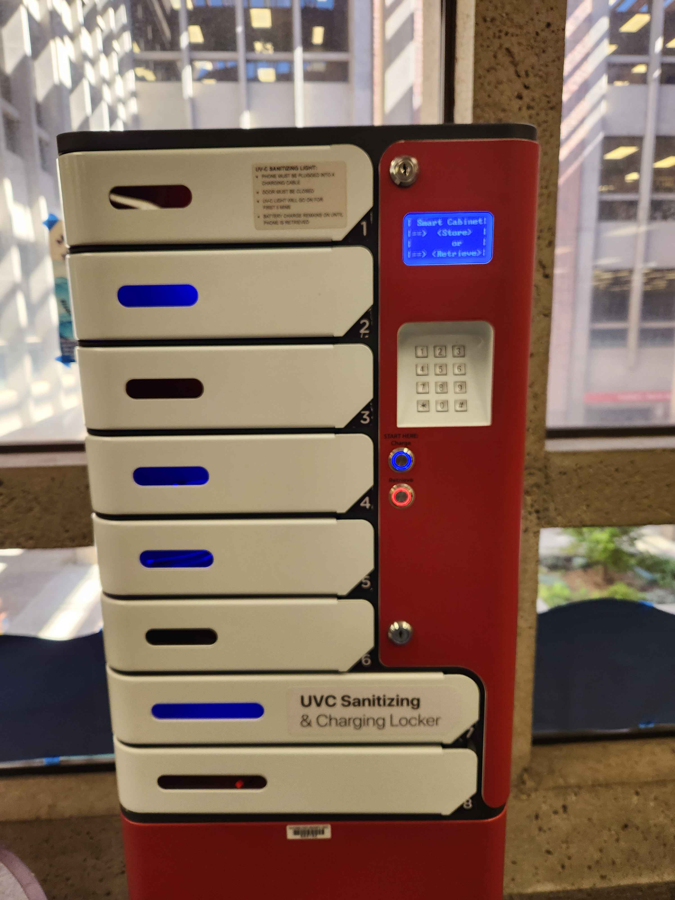
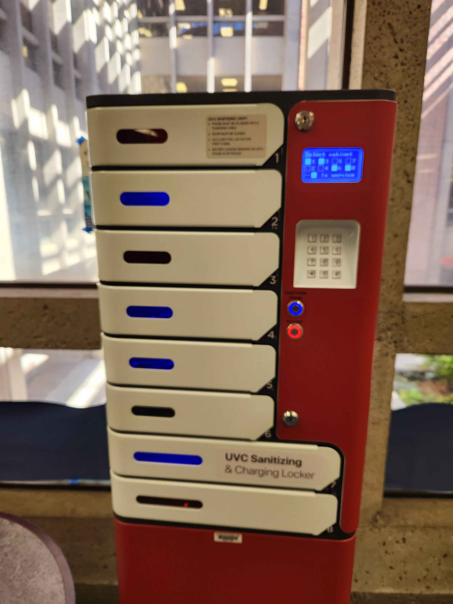
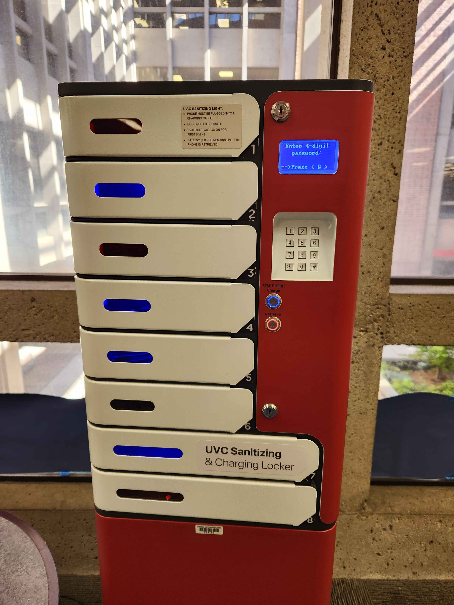
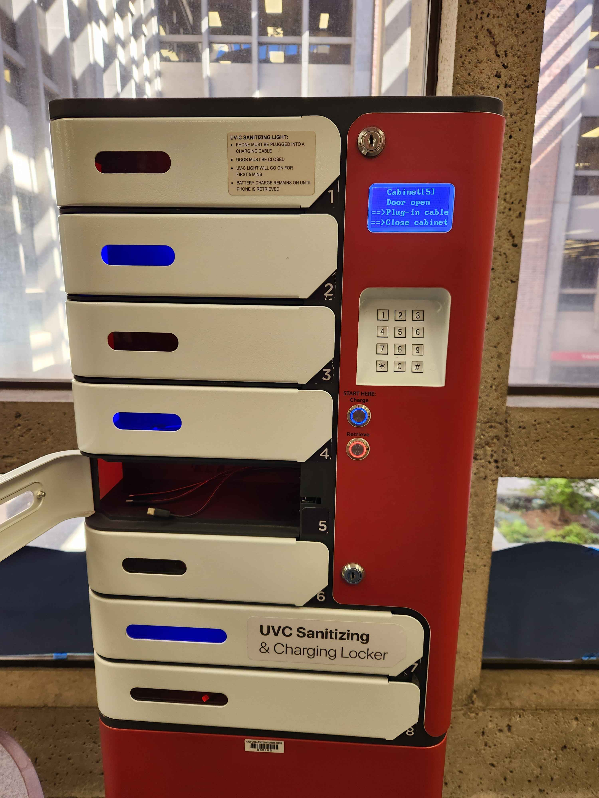
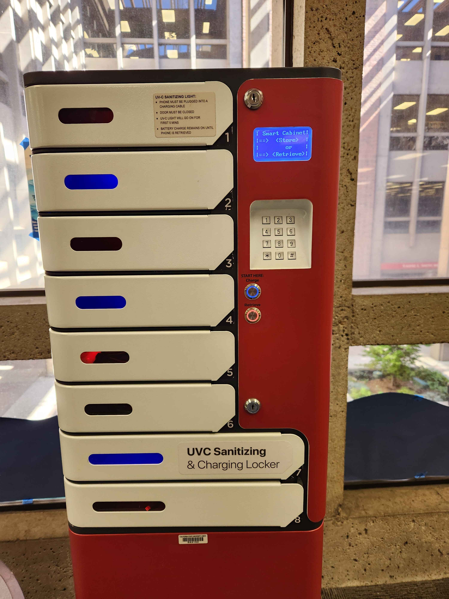

# Placing an item in a Charging Locker

I frequently charge my wireless earbuds using the charging lockers placed in the library on campus. They use distinct coloring to distinguish between the two actions that can be taken when using the locker: Charging and Retrieving. 

When I approached the locker, two buttons were lit up, a blue "charge" button and a red "retrieve" button. I noticed that there were several lockers lit up blue and red. This did a good job of **visually mapping** the actions of charging and retrieving with the status of the lockers. Visual mapping is when an object's function is visually shown through icons, color, or its placement

Once I selected the charge button, the screen displayed the lockers I could choose from. Lockers that were currently in use were represented by a filled in box; lockers that were empty were represented by an empty box. Because the screen is blue, the empty boxes are also the same blue as the charge button, while this may be unintended, it helped strengthen the idea that blue means open.

After I selected an open locker, the screen then prompted me to input a 4 digit pin twice. Requiring me to input my pin twice is a good safety measure that ensures that the locker is **error tolerant**. Something that is error tolerant is designed in such a way to prevent user error as well as reconcile user error. 

After I successfully entered my pin twice, the locker I selected and the light immediately switched from blue to red, telling me that the locker was in use. This was helpful as it made sure that I knew my locker would lock as soon as I closed the door. 

